# 🧠 Multi-Persona Council Agent

> **"A Boardroom in a Box"** — An intelligent, agentic system that brainstorms, debates, and synthesizes actionable strategies using a Council of AI Personas.


## 🌟 Why This Project Wins
This isn't just another chatbot. It's a **sophisticated decision-making engine** that mimics a real-world executive council. It features:
1.  **Dynamic Routing**: It doesn't just run everyone. It *thinks* about who is needed (e.g., calling the "Creative Thinker" only for abstract ideas).
2.  **Real-Time Intelligence**: It searches the *live web* for market data—no hallucinations.
3.  **Conflict Synthesis**: It forces diverse personas (Optimist vs. Critic) to debate until a consensus is reached.
4.  **🎙️ Podcast Mode**: It automatically converts the boring text plan into a **fun, 2-minute audio script** ready for production.

---

## 🚀 Key Features

### 1. 🚦 Dynamic Persona Router
The system analyzes your prompt keywords to assemble the perfect team:
-   **Core Team (Always Active)**: `Analyst` 📈, `Critic` 🛑, `Optimist` ✨.
-   **Creative Trigger**: Adds `Creative Thinker` 🎨 if you ask for "ideas", "abstract", or "new names".
-   **Expert Trigger**: Adds `Domain Expert` 🛠️ if you ask for "market", "cost", or "industry" data.

### 2. 🌐 Real-Time Web Search
The **Domain Expert** is equipped with `DuckDuckGo Search`.
-   *Competitors*: Use static/fake data.
-   *This Agent*: Fetches **live 2024/2025 market trends**, risk factors, and competitor analysis.

### 3. ⚖️ The Mediator (Consensus Engine)
A specialized `Gemini-1.5-Pro` agent that acts as the CEO.
-   **Strict Output Format**: It refuses to output generic text. It *must* produce:
    1.  **Risk & Regret Analysis** (Top 2 Risks + Mitigations)
    2.  **Strategic Consensus** (Where the Optimist & Critic agree)
    3.  **5-Step Action Plan** (With Owners & Deadlines)

### 4. 🎙️ Podcast Mode
After the plan is finalized, the **Podcaster Agent** takes over.
-   It writes a witty, engaging script between a Host, an Expert, and a Creative Guest.
-   Perfect for turning dry reports into consumable audio content.


---

## 🏗️ System Architecture

The system follows a **Router-Council-Mediator** pattern with a feedback loop, designed to simulate a brainstorming session between experts.

```mermaid
flowchart TD
    User([User Input]) --> Router[🚦 Router Agent]
    
    Router -- "Selects Experts" --> Decision{Is Chitchat?}
    
    %% Path 1: Simple Chitchat
    Decision -- Yes --> Greeter[💬 Greeter Agent]
    Greeter --> Output([Final Response])
    
    %% Path 2: Brainstorming Session
    Decision -- No --> P3
    
    subgraph CouncilBox [Dynamic Council - Parallel Execution]
        direction TB
        P1[📈 Analyst]
        P2[🛑 Critic]
        P3[✨ Optimist]
        P4[🎨 Creative Thinker]
        P5[🛠️ Domain Expert]
    end
    
    P1 & P2 & P3 & P4 & P5 --> Mediator[⚖️ Mediator Agent]
    
    Mediator -- "Synthesizes Reports" --> Check{Consensus Reached?}
    
    %% Feedback Loop
    Check -- "No (Request Refinement)" --> Feedback[⚠️ Feedback Loop]
    Feedback --> P3
    
    %% Success Path
    Check -- "Yes (Ready)" --> Podcaster[🎙️ Podcaster Agent]
    Podcaster --> Output([Final Podcast Script])

    %% Styling
    classDef agent fill:#f9f,stroke:#333,stroke-width:2px;
    classDef control fill:#ffd,stroke:#333,stroke-width:2px;
    classDef storage fill:#dfd,stroke:#333,stroke-width:2px;
    
    class Router,Greeter,Mediator,Podcaster,P1,P2,P3,P4,P5 agent;
    class Decision,Check control;
```



---

## 🛠️ Installation

1.  **Clone the repository:**
    ```bash
    git clone https://github.com/manavbhatt072/multi-persona-agent.git
    cd multi-persona-agent
    ```

2.  **Set up Virtual Environment:**

    **Mac / Linux:**
    ```bash
    python3 -m venv .venv
    source .venv/bin/activate
    ```

    **Windows:**
    ```bash
    python -m venv .venv
    .venv\Scripts\activate
    ```

3.  **Install dependencies:**
    ```bash
    pip install -r requirements.txt
    ```

4.  **Configure Environment:**
    Create a `.env` file and add your Google API Key:
    ```bash
    GOOGLE_API_KEY=your_api_key_here
    ```

---

## 💻 Usage

### Option 1: CLI (The "Hacker" Way)
Run the full loop in your terminal. Watch the agents debate in real-time!
```bash
python3 -m src.main
```

### Option 2: ADK Web Visualizer (The "Demo" Way)
See the beautiful agent graph and trace every thought process.
```bash
adk web . --port 8000
```
Then open `http://127.0.0.1:8000`.

---

## 📂 Project Structure

```
multi_personas_agent/
├── src/
│   ├── agents/
│   │   ├── personas.py       # The Council (Analyst, Critic, Optimist, etc.)
│   │   ├── router.py         # Dynamic selection logic
│   │   ├── mediator.py       # The CEO/Synthesis agent
│   │   └── podcaster.py      # 🎙️ The Scriptwriter
│   ├── flows/
│   │   └── system.py         # Orchestration (Parallel -> Sequential)
│   ├── tools/
│   │   └── expert_tool.py    # 🦆 DuckDuckGo Search Tool
│   ├── main.py               # CLI Entry Point
│   └── agent.py              # ADK Web Entry Point
├── requirements.txt          # Dependencies
└── .env                      # API Keys
```

## 🤝 Contributing
This is a private repository for the hackathon team.
1.  Fork & Clone.
2.  Create a feature branch (`git checkout -b feature/amazing-idea`).
3.  Commit & Push.
4.  Open a Pull Request.

---
*Built with ❤️ using Google ADK & Gemini Models.*
